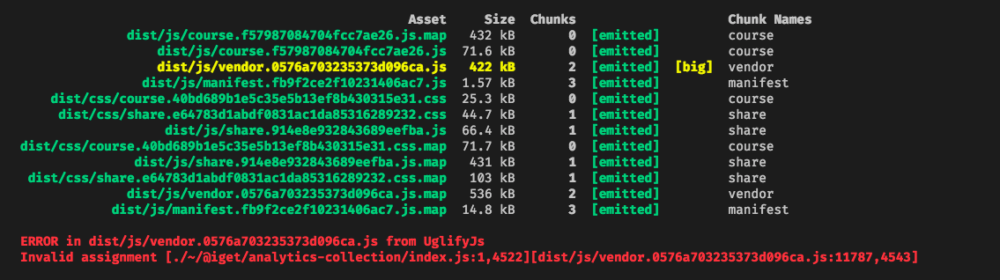
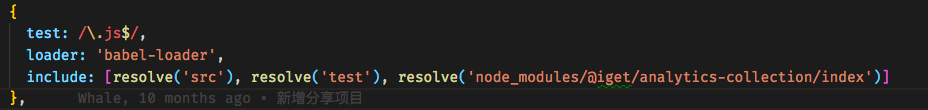

1. npm在安装react脚手架工具的时候报错，执行`create-react-app hello-react`时报错误`Unexpected end of JSON input while parsing near '...">=0.10.0"},"_hasShri'`，在npm的issue中找到网友的解决办法，执行命令`npm cache clean --force`即可解决。
--- 
2. npm install时报错`Error: EACCES: permission denied`,解决方案`sudo npm i --unsafe-perm=true --allow-root`
--- 

3. npm全局安装没有权限解决方法

官方给出的[解决方案](https://docs.npmjs.com/getting-started/fixing-npm-permissions)就是重新安装nodejs或者自定义全局安装node module的目录，但是对于如果已经开发很长时间的电脑再重新指定的话，成本过高，所以，实际上还有第三种方案，就是将没有权限的目录赋予权限：

```bash
sudo chown -R $(whoami) $(npm config get prefix)/{lib/node_modules,bin,share}
```
--- 

4. `npm run build`结束后报错`ERROR in dist/js/XXXXXXXXXX.js from UglifyJs`



在 UglifyJs 的 github issues #78 找到了这样一个解决方案：由于 UglifyJs 只支持 ES5 而 element-ui 可能引入了一部分 ES6 的写法，所以导致 webpack 打包失败,解决办法有2个方面: 
  - issue 里最后给出的解决方案是用 beta 版本的Uglify-es 来代替 UglifyJs（Beta 版本引入了对 ES2015+）的支持(未实践...不知道能不能解决问题)
  - 用bable处理引用的包文件,将其转换成ES5的语法,所以只需要修改webpack的配置文件即可,如下图:
  