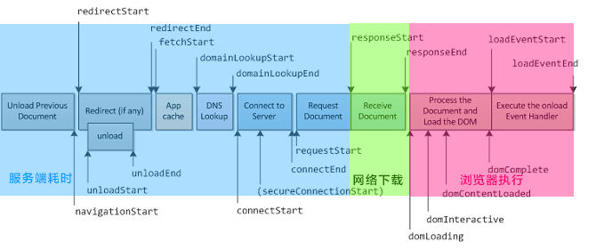
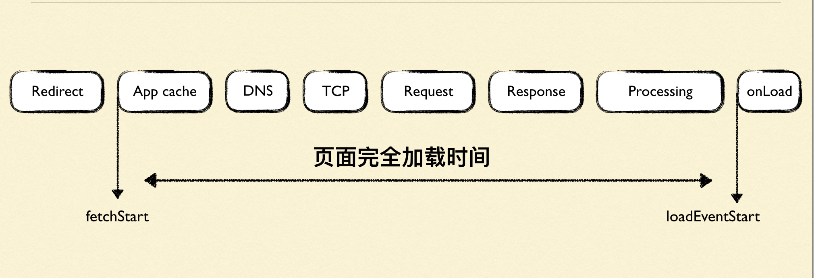
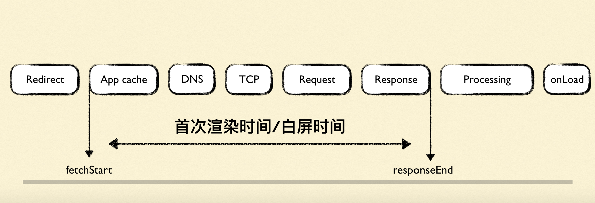
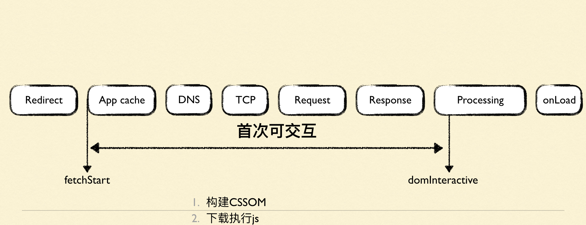
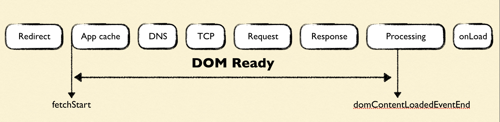

## 浏览器加载页面的整个过程

- redict 重定向阶段
  - redictStart 和 redictEnd:如果页面是由重定向而来,则 redictStart 和 redictEnd 分别代表重定向开始和结束的时间节点,否则都为 0
- fetchStart: 整个页面加载过程中开始的时间点
- DNS 解析阶段
  - domainLookUpStart 和 domainLookUpEnd: 分别代表 DNS 查询的开始和结束时间节点,如果浏览器没有进行 DNS 查询(比如使用了 cache),则两者的值均等于 fetchStart
- 建立 TCP 连接阶段
  - connectStart 和 connectEnd: 分别代表 TCP 建立连接和连接成功的时间节点,如果浏览器没有进行 TCP 连接(比如使用了持久化),则两者的值都等于 domainLookUpEnd 的值
  - secureConnectionStart: 在 https 中建立安全连接之前的时刻,没有 https 时则未 0
- 发起 request 阶段
  - requestStart: 浏览器发起请求的时间节点,不管是请求服务器/缓存/本地资源
- 收到 response 响应阶段
  - responseStart 和 responseEnd: 分别代表从服务器端(或者缓存,或者本地资源)收到响应回的第一个字节和最后一个字节的时间点
- 浏览器执行阶段
  - domLoading: 浏览器开始解析 html 文档第一个字节的时间点,就是 document.readyState 变为 loading 那一刻的时间点
  - domInteraction: 就是 dom tree 构建完成的时间,然后状态会由 loading => interactive,仅仅只是 dom 构建完成
  - domContentLoadedEventStart: 这个时间点就是 dom 和 cssom 都准备就绪了,准备开始渲染 renderTree
  - domContentLoadedEventEnd: 表示 domContentLoaded 事件完成,这个时间点就是 jquery 里面 domready 的那个时间,同步的 js 脚本加载执行完成
  - domComplete: 所有处理完成,renderTree 完全构建完成,所有资源也准备就绪
  - loadEventStart 和 loadEventEnd: 对应 window.onload 事件触发和结束的时间节点,onload 事件表示所有的资源都加载完了.包括图片/字体等等,也就是页面完全加载完成

## 页面加载中的一些关键性指标

### 页面完全加载时间

页面完全加载时间 = loadEventStart - fetchStart

### 首次渲染时间/白屏时间

白屏时间 = responseEnd - fetchStart

### 首次可交互时间

首次可交互时间 = domInteraction - fetchStart

### DOM ready 时间

DOM ready 时间 = domContentLoadedEventEnd - fetchStart

### TTFB(Time to first Byte)

TTFB 时间 = responseStart - requestStart

### 内容传输时间

内容传输时间 = responseEnd - responseStart

## 页面性能优化

### 重定向

1. 避免不必要的重定向

一个比较典型的重定向就是有的 url 不是以`/`结尾,但是非要在末尾加上`/`,虽然最后也能访问得到,但其实造成了不要的重定向

### DNS 查询

1. 减少页面的唯一域名
   > 每次 DNS 查询都是查找唯一域名的过程,那么域名越少,DNS 查询就越少,应用尽量将资源放在同一域名下,当然这样做可能又会有统一域名下的最大连接数的问题,所有需要权衡
2. 利用 pre-fetch 给页面中的域名做预解析: ``

### TTFB

1. 减少 cookies 大小,设置合适的过期时间
2. 静态资源直接上没有 cookie 的 CDN
3. 压缩到合适的大小

### DOM 解析

js 的 defer 和 async 的区别

